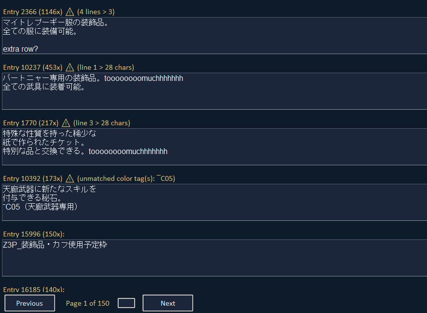
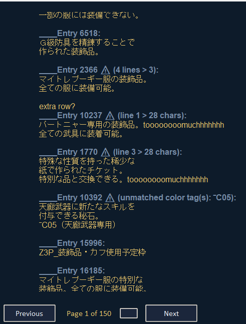
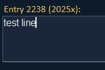
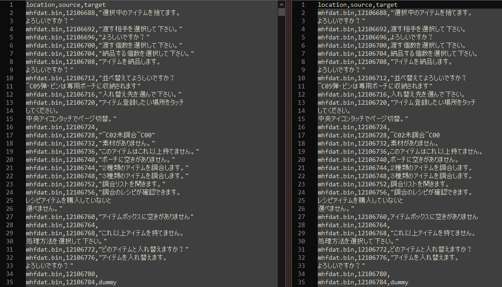
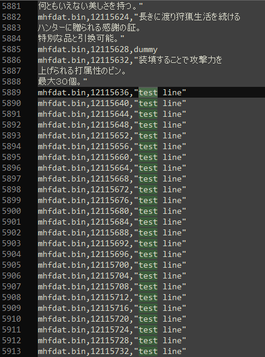

# 🧈 ButterCSV-Editor

A GUI CSV Editor for translations and formatting — mainly for **MHF-Z** item descriptions or other `mhfdat.bin` content.

---

## 🚀 How to Use

1. Run the script with:

    ```bash
    python ButterCSV.py
    ```

2. The GUI will launch and auto-generate a `theme.ini` file in the same directory as the script.

💡 **Tip for Windows Users:**  
Navigate to the script’s folder, click the address bar, type `cmd`, and press Enter to open a command prompt in that location.

❗ *Linux not yet tested.*

---

## ✅ Current Features

- Launch info
- **Duplicate line** merging and rebuilding
- **Duplicate count** filtering
- **List Mode** for mass editing/copying
- Right-click **context menus** in List/Main Mode
- **Settings Page** for:
  - Character limit
  - Max lines per entry
  - Entries per page
- **CSV line fixing** (for broken quotes: `"` issues)
- **Dummy line skipping** (dummy & dev-only lines are ignored)
- **Save Caching**:
  - Auto-generates `_autosave_translation_cache.csv` <-- Same dir as script
- **Custom Styling**:
  - Generates `theme.ini` <-- Same dir as script
- **Warnings**:
  - Console warnings for line/char limits during rebuild
  - Entry line warnings if you exceed limits while editing
  - Color code validation for tags like `‾C01+`, `‾C00`

> ⚠️ Color codes must **start with `‾CXX` and end with `‾C00`** <-- DOES NOT COUNT TOWARD CHARACTER LIMIT

---

## 🔧 TODO

- Cache loading (option to load a cache file)
- Additional default theme options
- Better theme customization UI (maybe add to settings)

---

## 🖼️ Screenshots

### Main Mode (after loading a CSV with warnings)


---

### List Mode (mass editing, also shows warnings)


---

### Settings Page (character count, line limits, entry amount per page)


---

### Page Jumping (enter number + press `Enter`)


---

### Duplicate Entry Merging (number = count of duplicates)


---

### Sorting Options (by duplicate count, asc/desc)


---

### Quotation Fixing (broken quotes fixed in rebuilt CSV)
**Left:** Fixed output • **Right:** Original


---

### Example Rebuilt File (after editing) <-- same line as in the `Duplicate Entry Merging` img


---

### 📂 Use FrontierTextHandler by `Houmgaor` to extract the CSV file

**Source:** [Houmgaor/FrontierTextHandler on GitHub](https://github.com/Houmgaor/FrontierTextHandler)
