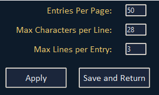
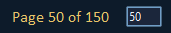

# ButterCSV-Editor
A GUI CSV Editor for translations and formatting, mainly for MHF-Z item descriptions or other descriptions/mhfdat.bin info.

HOW-TO-USE:
    Simply just run the script with `python ButterCSV.py` and the gui will launch and generate the theme.ini in the same directory as the script location.
    (On Windows, you can click on the folder URL then type `cmd` to launch a cmd at that location.) [Haven't tested on linux]

Current Features:
    *Launch info
    *Duplicate line merging/rebuilding.
    *Duplicate amount filtering.
    *List mode for mass editing/copying.
    *Right click context menu for List/Main Mode
    *Settings page for character amount, max lines, and amount of entries per page.
    *CSV Line fixing for `"` locations
    *Dummy line / Development line skipping
    *Save caching, generates autosavecache.csv (same directory as the script)
    *Save location on rebuild (get to choose)
    *Custom styling, generates theme.ini (same directory as the script)
    *Warnings in console when rebuilding for line limit/character limit
    *Warnings on entry line ID's when editing if you pass either line or character amount.
    *Warnings for broken color code tags (‾C01+) (‾C00)   <--- Color codes are any number higher than the ‾C00 but must have the ending ‾C00
TODO:
    *Cache loading/option load cache file.
    *Different base theme options for default.
    *Theme.ini comments or maybe add to settings page
    

This is a preview of what the warnings and main mode looks like after loading a csv file.

This is the same thing as above just in List-Mode.

Settings Page for adjusting the character amount, max lines and entries per page.

Page seeking just put in a number and press `enter` to jump to that page.

Any duplicate entry will be merged into one line for mass replacing the (number) next to the entry is the duplicates amount.

You can also sort the entries by either max duplicate amount or asc and desc.

As for rebuilding the csv after making changes, any line that was previous broken `"` in lines will be fixed in the output.
Left side is the original csv and the right is the rebuild.

Here is an example of a rebuilt file with changes (same line as duplicate photo).

